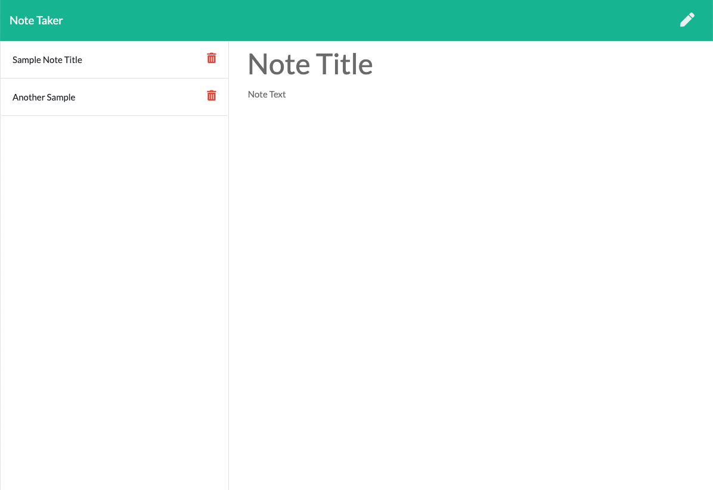

# Note Taker [Demo](https://secret-ravine-58567.herokuapp.com/) 



## Description

This is a Node CLI application that can be used to write, save, and delete notes. This application uses [Express](https://expressjs.com/) as a backend and saves and retrieves note data from a JSON file. 

## Installation

This project uses the Express package. To install run:

```
npm i
```

## Usage

Feel free to clone or fork this repo if you find it useful. To start the server just run:

```
node server.js
```

Then open your browser at localhost:8080. From there you can add a note title and description. You can save the note and it will be displayed on the sidebar. Finally you can delete a note by clicking the trash can icon.  
## License

MIT 

## Contributing

To contribute to this project do a pull request. 

## Questions?


Have any questions? Want to collaborate on a project? Shoot me an [email](yarocruz@gmail.com)
  
